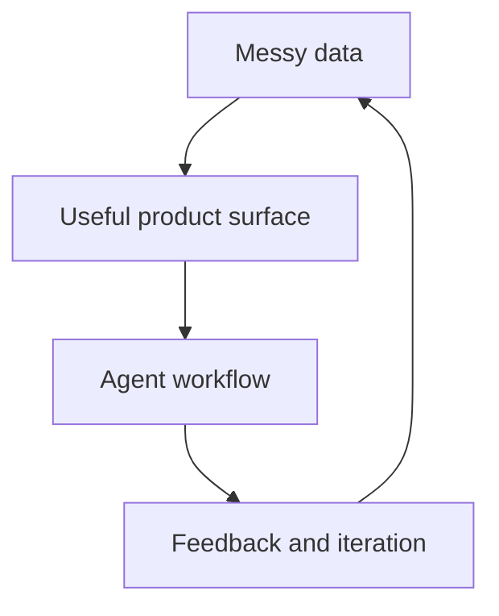

# Ricardo Jorge · RJ

### AI Product Engineer · Lisbon, Portugal

> I make complex systems legible — from data-rich product surfaces to agent workflows that turn AI into something people can actually use.

I’ve been building with AI since the first releases of Copilot and ChatGPT, moving from prompt and context engineering into custom skills, agent harnesses, and automations. My home base is hands-on product engineering: TypeScript, React, Next.js, and the data visualisations that make a product feel real.

[Website](https://rj11.io) · [GitHub](https://github.com/rj11io) · [LinkedIn](https://www.linkedin.com/in/rj11io) · [Email](mailto:ricardojorgexyz@gmail.com)

```ts
const rj = {
  focus: [
    "AI product engineering",
    "data visualisation",
    "agent systems",
  ],
  core: ["TypeScript", "React", "Next.js"],
  operatingMode: "end-to-end",
  roots: ["game mods", "LEGO Mindstorms"],
};
```

## What I’m building now

The public projects are the clearest way to see what I’m exploring:

- **[11io](https://rj11.io)** — personal brand for B2B freelancing · `2025–Present`
- **[11ai](https://ai.rj11.io)** — open-source AI skills, plugins, and workflows · `2026–Present`
- **[11bench](https://bench.rj11.io)** — open-source AI benchmarks · `2026–Present`

## The thread

Across dashboards, data explorers, product platforms, and agent automations, I keep returning to the same loop: find the signal, shape the surface, automate the follow-through, and keep the feedback loop open.



In plain terms: I like working where data, interface, and automation meet — and where someone still has to care about the last 20% of the product.

## Build with

- **Core product stack:** TypeScript · React.js · Next.js · AI SDK · Convex · Playwright · Vercel
- **AI engineering:** agent automations · custom agent skills · harness engineering · Codex · Claude Code · n8n
- **UI and design systems:** Tailwind CSS · shadcn/ui · Material-UI · Storybook · design systems · Refactoring UI
- **Data and visualisation:** dashboards · d3 · Recharts · Nivo · web scraping · data enrichment
- **Delivery:** GitHub Actions · CI/CD · REST APIs · testing · product design · team and project management

## Selected experience

### AI Product Engineer · [rj11io](https://rj11.io) · `Mar 2025–Present`

Hands-on AI product engineering for multiple early-stage startups, building from the ground up: AI data extraction from PDFs, AI SEO analytics, a GenAI dermatopathology portal, AI chats and custom GPT experiences, cybersecurity dashboards, proprietary data explorers, and agent harnesses, skills, and automations.

### Product / Datavis Engineer · [Hunt Intelligence](https://hunt.io) · `Apr 2024–Mar 2025`

- Went deep on data visualisation for a threat-intelligence product, including the **IP History Widget**.
- Built core product modules **AttackCapture™** and **HuntSQL™**.
- Built an OpenAPI-based API documentation platform with enriched metadata and a friendlier UI than Swagger.
- Shipped on a TypeScript / Next.js / shadcn/ui stack with Playwright, Vercel, and GitHub Actions.

### Senior Frontend Engineer → Team Lead · [OMEGA Systems](https://omegasys.eu) · `Jun 2023–Apr 2024`

- Built the next generation of the iGaming platform management system **CORE5** with TypeScript and React.
- Led frontend work across dashboards, reports, configuration views, localisation, and an internal “Tab System” UI.
- Built the “New Developer” onboarding experience and set standards for tickets, documentation, and remote / async workflows.

### Senior Frontend Engineer · [Phantasma Chain](https://phantasma.info) · `Jan 2022–May 2023`

- Built a frontend monorepo for new tools and apps, the **Phantasma UI Storybook**, and **Phantasma Explorer**.
- Used Playwright, GitHub Actions, and Vercel for testing, CI, and CD.
- Contributed improvements to the Phantasma TypeScript SDK and built internal hooks, localisation, theming, and environment tooling.

### Frontend Lead · [BinaryEdge / Coalition](https://coalitioninc.com) · `Feb 2020–Oct 2021`

- Started as a solo frontend engineer and grew a team focused on customer-facing security apps and internal tools.
- Introduced React, TypeScript, Next.js, and micro frontends to the frontend stack.
- Built Attack Surface Monitoring on the BinaryEdge Portal, later integrated into Coalition Explorer and Coalition Control.
- Led the Coalition Explorer, Storybook, component-library, data-visualisation, and GitHub Actions work.

<details>
<summary>Earlier chapters: 2015–2019</summary>

- **Glaiveware** — Fullstack Engineer, Co-Founder · `Mar 2018–Dec 2019` · bespoke web apps and the first real lessons in managing projects and a business.
- **Sycret.ink** — React Native Developer · `Jan–Dec 2017` · a mobile chat app with end-to-end encryption in a serverless environment.
- **American Heart Association** — Full Stack JavaScript Developer · `Sep–Nov 2016` · an admin dashboard for Kinect integration, user / doctor / patient workflows, reports, and system management.
- **NextBitt** — Frontend Developer · `Oct 2015–Jul 2016` · analytics dashboards, reporting, auditing, and management tools.
- **Science4you** — Java Developer · `Jan–Mar 2015` · internship building a Java / MySQL online-store management system.

**Education:** IT Systems Management and Programming, Escola Profissional de Tecnologia Digital · `2013–2016`

</details>

## A little history

I started coding young for fun: modding and reverse-engineering games and consoles, building a fighting game with the MUGEN engine, and running dedicated servers for Counter-Strike, Minecraft, and other titles. At 14, my LEGO Mindstorms team placed second nationally and reached the final four of the 2008 robotics world cup in China.

The childhood projects changed. The instinct did not: take a complicated system apart, understand how it works, then build a better way through it.

## Let’s build

If you’re building a product where data is difficult to make useful, or AI needs an actual interface and workflow around it, [say hello by email](mailto:ricardojorgexyz@gmail.com). You can also start with [rj11.io](https://rj11.io), [11ai](https://ai.rj11.io), or [11bench](https://bench.rj11.io).
