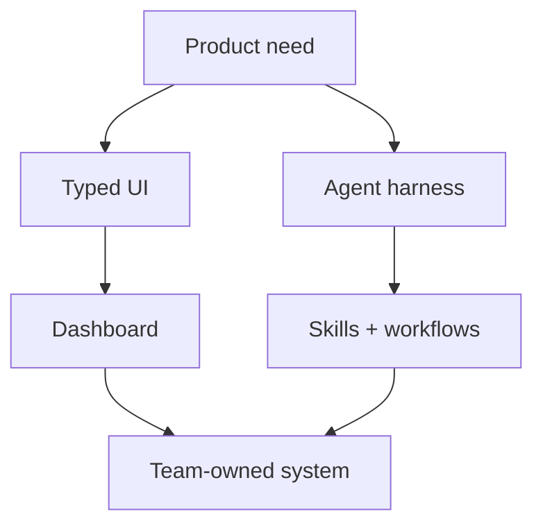

<h1 align="center">Ricardo Jorge</h1>

<p align="center">
  <strong>RJ - AI Product Engineer</strong><br>
  Lisbon-based builder of TypeScript product systems, data explorers, and agent workflows.
</p>

<p align="center">
  <a href="https://www.rj11.io/">rj11.io</a> &middot;
  <a href="https://ai.rj11.io/">11ai</a> &middot;
  <a href="https://bench.rj11.io/">11bench</a> &middot;
  <a href="mailto:ricardojorgexyz@gmail.com">email</a> &middot;
  <a href="https://www.linkedin.com/in/rj11io">linkedin</a>
</p>

I turn ambiguous AI/data problems into product surfaces: TypeScript frontends,
dashboards that explain messy systems, and agent harnesses that automate the
repeat work around them.

I have a decade of professional TypeScript experience, have built on React
since 2016 and Next.js since 2018, and am often the first frontend hire in the
room: architecture, tooling, component library, CI/CD, onboarding, and the
playbooks that let the next engineers move faster.

```txt
target   -> unclear product/data/AI problem
shape    -> workflow + data model + automation edge
build    -> UI + tests + deploy + docs
compound -> components + agent skills + playbooks
```

## Current Signal

- AI Product Engineer at [rj11io](https://www.rj11.io/) since Mar 2025, building projects from the ground up for early-stage startups.
- Recent work spans PDF data extraction, AI SEO analytics, a GenAI dermatopathology portal, cybersecurity dashboards, proprietary data explorers, AI chats/GPT experiences, smart scraping agents, n8n workflows, and agent harnesses.
- Public project surfaces: open-source AI skills/plugins/workflows at [11ai](https://ai.rj11.io/) and open-source AI benchmarks at [11bench](https://bench.rj11.io/).

## Project Map

| Surface | What to expect |
| --- | --- |
| [11io](https://www.rj11.io/) | Personal brand for B2B freelancing and current work |
| [11ai](https://ai.rj11.io/) | Open-source AI skills, plugins, and workflows |
| [11bench](https://bench.rj11.io/) | Open-source AI benchmarks |
| [Modern GitHub](https://github.com/rj11io) | AI/open-source work from 2023 onward |
| [Legacy GitHub](https://github.com/ricardojrmcom?tab=repositories) | Open-source code produced from 2020 to 2023 |



## Stack I Reach For

`TypeScript` `React.js` `Next.js` `AI SDK` `Convex` `Playwright` `Vercel`
`Tailwind CSS` `shadcn/ui` `Storybook` `d3` `Recharts` `Nivo`
`GitHub Actions` `Codex` `Claude Code` `n8n`

I care most about the joins: product design with implementation, data
visualisation with UX, AI agents with actual delivery, and frontend systems
that a growing team can understand.

## Where The Judgment Came From

- Threat intelligence and cybersecurity: Hunt Intelligence, BinaryEdge, and Coalition work on data visualisation, Attack Surface Monitoring, Coalition Explorer, AttackCapture, HuntSQL, API docs, and customer/security tooling.
- Gaming platforms: OMEGA Systems CORE5, where I built data-heavy iGaming management views and later led the frontend team.
- Crypto tooling: Phantasma Chain frontend monorepo, Phantasma UI Storybook, Phantasma Explorer, SDK improvements, tests, CI, and Vercel deployment.
- Startup/product foundations: co-founding Glaiveware, building bespoke web apps, and handling the non-code parts that make product work real.

## Before The Job Title

I started by modding and reverse-engineering games and consoles, built a MUGEN
fighting game, and ran dedicated servers for Counter-Strike, Minecraft, and
other games. At 14, my LEGO Mindstorms team placed second nationally and
reached the final four of the 2008 robotics world cup in China.

<details>
<summary>Selected timeline</summary>

- **Mar 2025 - Present:** AI Product Engineer, rj11io. B2B AI product engineering for early-stage startups.
- **Apr 2024 - Mar 2025:** Product / Datavis Engineer, Hunt Intelligence. Threat-intelligence visualisation, AttackCapture, HuntSQL, OpenAPI-based docs, Playwright, GitHub Actions, Vercel.
- **Jun 2023 - Apr 2024:** Senior Frontend Engineer -> Team Lead, OMEGA Systems. CORE5 iGaming platform management, dashboards, onboarding, frontend standards.
- **Jan 2022 - May 2023:** Senior Frontend Engineer, Phantasma Chain. Frontend monorepo, Storybook, Explorer, SDK improvements, Playwright, GitHub Actions, Vercel.
- **Feb 2020 - Oct 2021:** Frontend Lead, BinaryEdge / Coalition. Customer security apps, internal tools, micro frontends, component library, data visualisations, CI/CD migration.
- **Mar 2018 - Dec 2019:** Fullstack Engineer and Co-Founder, Glaiveware. Bespoke web apps, project management, business operations.
- **2015 - 2017:** Early professional roles at Science4you, NextBitt, American Heart Association, and Sycret.ink across Java, analytics dashboards, full-stack React/Node, and encrypted React Native chat.
- **2013 - 2016:** IT Systems Management and Programming, Escola Profissional de Tecnologia Digital.

</details>

## Work With Me

I am open to exceptional AI/product opportunities, especially where the work
involves data-heavy interfaces, agent harnesses, product engineering from zero,
or a frontend foundation that needs to scale with the team.

Start at [rj11.io](https://www.rj11.io/) or send a note to
[ricardojorgexyz@gmail.com](mailto:ricardojorgexyz@gmail.com).
