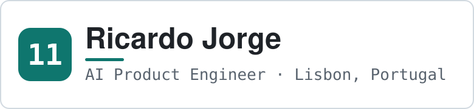
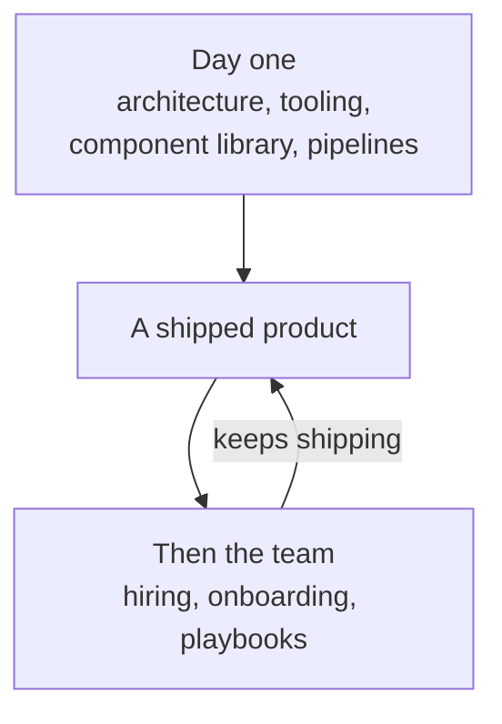

<!--
  Profile README for github.com/rj11io  →  lives in the repo rj11io/rj11io
  Written from content.md. Research and compatibility notes in research.md.

  Deliberately: no third-party services, no tracking pixels, no dynamic badges,
  no stats cards, no animation. The only two assets are local SVG files.
  Please read research.md section 6 before editing them.
-->

<picture>
  <source media="(prefers-color-scheme: dark)" srcset="assets/banner-dark.svg">
  <source media="(prefers-color-scheme: light)" srcset="assets/banner-light.svg">
  
</picture>

**I've been taking systems apart since long before anyone paid me to.** Games and
consoles, dedicated servers, LEGO robots. The habit stuck — I just build them now
instead.

I'm Ricardo Jorge, and most people call me RJ. I build AI products out of Lisbon,
Portugal. I went professional in 2015 and specialised in frontend TypeScript — React
from 2016, Next.js from 2018, which turned out to be an early bet on the stack that
both the web and AI products settled on.

On most projects since, I've been the first frontend hire. That means I own the
architecture, the tooling, the component library and the pipelines from day one, and
then hire and onboard the people who work inside them. Most of that work has been
dashboards, product platforms and in-house data explorers for cybersecurity, crypto
and gaming companies — which is where I got hooked on data-heavy products and
visualisation, and where I learned what separates a polished product from a prototype.

Since March 2025 I've worked as a hands-on B2B freelancer under my own name, building
AI products for early-stage startups. I've built with AI since the first releases of
Copilot, ChatGPT and MidJourney, moving from autocomplete, to prompt and context
engineering, to designing full agent harnesses — the scaffolding that lets an AI agent
run a real job on its own. Today a fleet of those agents maintains my personal
projects.

> **I operate as a self-guided missile.** Point me at a target and I'll figure out how
> to hit it on my own, using everything I've learned to avoid the pitfalls and drive
> straight to the solution.

## What I'm building now

- **[11io](https://www.rj11.io/)** — my brand for B2B freelancing. Since 2025.
- **[11ai](https://ai.rj11.io/)** — open-source AI skills, plugins and workflows. Started this year.
- **[11bench](https://bench.rj11.io/)** — open-source AI benchmarks. Also started this year.

The code lives in two places: **[github.com/rj11io](https://github.com/rj11io)** for
the current AI and open-source work, and
**[github.com/ricardojrmcom](https://github.com/ricardojrmcom)** for everything I
shipped between 2020 and 2023.

## What companies hire me for

The pattern repeats. I come in as the first frontend engineer and build the
foundations, we ship, and then I grow the team that keeps shipping — interviewing,
hiring, onboarding, and writing the playbooks that let new engineers integrate
seamlessly.

## Selected work

- **AI Product Engineer** · [rj11io](https://www.rj11.io/) · Mar 2025 – present  
  Hands-on AI product engineering for early-stage startups, built from the ground up:
  AI data extraction from PDFs, AI SEO analytics, a GenAI dermatopathology portal, a
  real estate platform, cybersecurity dashboards, proprietary data explorers, AI chats
  and custom GPT experiences, smart scraping agents and n8n workflows — plus the agent
  harnesses, skills and automations behind them.

- **Product / Datavis Engineer** · [Hunt Intelligence](https://hunt.io/) · Apr 2024 – Mar 2025  
  Left OMEGA to go deep on my specialty: data visualisation for a threat-intelligence
  product. Built the AttackCapture™ and HuntSQL™ product modules, custom components
  like the IP History Widget, and a new API documentation platform on top of OpenAPI —
  enriched the raw `openapi.json` with metadata and shipped a UI friendlier than
  Swagger. Modern TypeScript codebase throughout: Next.js, shadcn/ui, end-to-end tests
  in Playwright, CI/CD on GitHub Actions, staging and production on Vercel, release
  changelogs piped into Slack.

- **Senior Frontend Engineer → Team Lead** · [OMEGA Systems](https://www.omegasys.eu/) · Jun 2023 – Apr 2024  
  Joined to build CORE5, the next generation of OMEGA's iGaming platform management
  system, and was promoted to lead the frontend team. Data visualisation for the Main
  and Social dashboards plus the report and configuration views, the localisation
  module, and an internal Tab System UI. As lead: the new-developer onboarding
  experience, standards for tickets, documentation and async work, and a weekly TED
  talk to keep the whole team current on technology and product.

- **Senior Frontend Engineer** · [Phantasma Chain](https://phantasma.info/) · Jan 2022 – May 2023  
  Built the frontend monorepo behind all the new tools and apps, designed and built
  the Phantasma UI Storybook, built Phantasma Explorer, and contributed improvements
  back to the Phantasma TypeScript SDK. Playwright for tests, GitHub Actions for CI,
  Vercel for CD.

- **Frontend Lead** · [BinaryEdge / Coalition](https://www.coalitioninc.com/) · Feb 2020 – Oct 2021  
  Joined as the solo frontend engineer on the customer security team and grew a team
  around customer-facing security apps and internal tools. Introduced React,
  TypeScript, Next.js and micro frontends — independently deployable slices of one web
  app. Built Attack Surface Monitoring on the BinaryEdge Portal, later folded into
  Coalition Explorer and Coalition Control. Tech lead for Coalition Explorer and the
  more ambitious Explorer 2.0, which housed critical internal tools for the whole
  company, and for the Coalition Storybook and its data visualisations. Moved the
  frontend CI/CD from Drone to GitHub Actions.

<b>Earlier: 2015 – 2019, and where I studied</b>

- **Fullstack Engineer, Co-Founder** · Glaiveware · Lisbon · Mar 2018 – Dec 2019  
  Bespoke web apps above market standards. The part that stuck was learning to run a
  business and manage projects, not just write React.

- **React Native Developer** · Sycret.ink · Neuchâtel, Switzerland · Jan 2017 – Dec 2017  
  A mobile chat app with end-to-end encryption in a serverless environment, under
  contract with a team of three. Where I learned about encryption protocols and mobile
  deployment.

- **Full Stack JavaScript Developer** · American Heart Association · Sep 2016 – Nov 2016  
  An admin dashboard for the AHA's Kinect integration: connecting doctors with their
  patients and the collected data, printing reports, and letting superusers run the
  system. It came through a university scholarship with a free choice of technology, so
  I used it to build my first full-stack web app, in React and Node.

- **Frontend Developer** · NextBitt · Lisbon · Oct 2015 – Jul 2016  
  Analytics dashboards plus reporting, auditing and management tools for an asset and
  facilities management product. jQuery, Angular.js and .NET, a lot of awkward
  date/time logic, and my first serious run at data visualisation.

- **Java Developer** · Science4you · Lisbon · Jan 2015 – Mar 2015  
  Internship. A back-office display-and-print tool for the online store that grew into
  a full application managing orders, printing reports and emailing customers — all of
  which had been done by hand until then.

**Education** — IT Systems Management and Programming, Escola Profissional de
Tecnologia Digital, Lisbon, 2013 – 2016. *Técnico de Gestão e Programação de Sistemas
Informáticos.*

## Stack

- **Core** — TypeScript · React · Next.js · AI SDK · Convex · Playwright · Vercel
- **AI engineering** — agent automations · custom agent skills · harness engineering · Codex · Claude Code · n8n
- **UI and design** — Tailwind CSS · shadcn/ui · Material-UI · design systems · Storybook
- **Data and visualisation** — dashboards · d3 · Recharts · Nivo · web scraping · data enrichment
- **Leadership and delivery** — team and project management · end-to-end product engineering · product design · agile
- **Foundations** — JavaScript · Node.js · HTML · CSS · Git · GitHub Actions · REST APIs · CI/CD · testing

## Before this was a job

I started young and entirely for fun: modding and reverse-engineering games and
consoles, building my own fighting game on the MUGEN engine, and running dedicated
servers for Counter-Strike, Minecraft and half the titles I grew up on.

At 14, programming LEGO Mindstorms robots in science class took our team to second
place nationally and to the final four of the 2008 robotics world cup in China.

Competitive gaming taught me the rest. I led teams, guilds and clans to the top of
online ladders and to LAN tournament wins, which turned out to be management training
in disguise: recruiting, coaching, and keeping a roster of hyperactive remote teenagers
aligned on one strategy.

## Where to find me

- **[rj11.io](https://www.rj11.io/)** — what I do, and who I do it for
- **[cv.rj11.io](https://cv.rj11.io/)** — the two-page CV, or [the extended version](https://cv.rj11.io/v1/max) for the whole story
- **[linkedin.com/in/rj11io](https://www.linkedin.com/in/rj11io)** — LinkedIn
- **[ricardojorgexyz@gmail.com](mailto:ricardojorgexyz@gmail.com)** — email

I'm always open to exploring exceptional opportunities. Reach out if you're keen on
working together.

Have a nice day!
